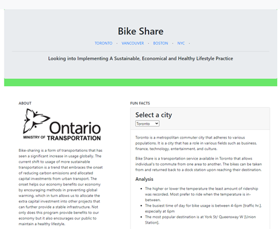

# PROJECT 3

SUSTAINABLE . ECONOMICAL . HEALTHY LIFESTYLE

## Bike Share Canada
An application that serves as a library keeping track of the ridership, usage and popularity of the Bike Share program in select cities. Aiming to provide relatable and real time knowledge of the usership of a Bikie Share infrastructure. Allowing the federal governement to be transaparent to the public of their research into the feasibilty of implementing bike Share across Canada. 

## Links
- Link to app: https://bike-share-bootcamp.herokuapp.com/ 
- Link to GCP: https://console.cloud.google.com/home/dashboard?project=bikeshare-303620
- Link to Presentation: https://docs.google.com/presentation/d/1oqc4o01UI3_C9ro_ewJhr7cCF1w4j0-iWKb34v9Da-s/edit?usp=sharing 

## Web Home Page

## Web Page Services
**NOTE:** Services provided for the following cities
- Toronto, Canada
- Vancouver, Canada
- Boston, USA
- NYC, USA

**Our Services:**
- Pricing Index
- Weather Details
- Annual Trip Data
- Popular Station Details
- Popular Time Interval
- Travel Routes
- City Station Maps

## Technologies Used
- Bs4
- CSS
- D3
- Google Cloud Platform (Big Query)
- Heroku
- HTML
- Javascript
- Leaflet
- oauthlib
- Pandas
- Plot.ly
- Python

## Contributors
1. Catherine Tratnik
2. Manish Lal
3. Myfanwy Brown-Robinson
4. Rubalpreet Bhullar
5. Sharanvika Jegatheeswaran

